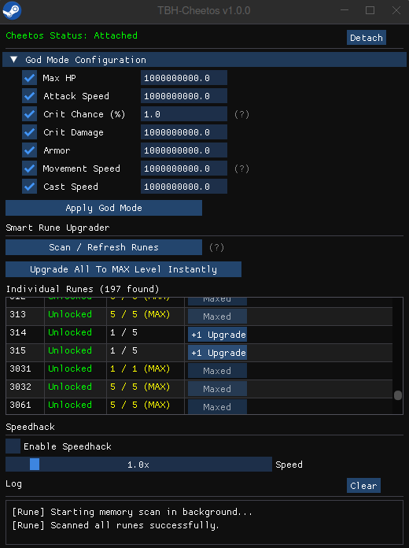

# TaskBarHero - Cheetos

A feature-rich, interactive graphical memory Cheetos for **TaskBarHero**. This tool directly interacts with the game's memory using the Win32 API and IL2CPP metadata to provide a comprehensive suite of cheats—all from a single lightweight, blazing-fast GUI built with **Dear ImGui**.

## Features

| Feature | Description | Status |
|---------|-------------|--------|
| **Bypass anticheat** | Neutralizes ANti-cheat detector methods when attached | ✅ Automatic |
| **God Mode** | One-shot injection of max HP, Attack Speed, Crit, Armor, Movement Speed into all active heroes | ✅ Repeatable |
| **Rune Unlocker** | Safely unlock and max-level all runes for free | ✅ Interactive |
| **Speedhack** | Increases the speed of the game | ✅ Toggle ON/OFF |

### Additional Capabilities
- **Seamless GUI** — A beautifully rendered floating window (via OpenGL3/GLFW) for real-time interaction.
- **Hot-Pluggable** — Connect and disconnect from the game instantly without restarting the Cheetos.
- **Cross-Platform** — Native Windows `.exe` that runs flawlessly on Linux and macOS via Proton/Wine.
- **Automated Offset Updating** — Ships with Python scripting to effortlessly upgrade IL2CPP offsets after game patches.


## Preview



## Prerequisites (For Source Building)
To compile from source, you will need:
- [CMake](https://cmake.org/) (v3.10 or higher)
- [vcpkg](https://github.com/microsoft/vcpkg) (dependencies are managed automatically via `vcpkg.json`)
- **Windows:** Visual Studio (MSVC) or MinGW-w64
- **Linux/macOS:** MinGW-w64 (for cross-compiling to Windows `.exe`)

---

## How to Build

First, ensure you clone the repository with its `vcpkg` submodule:
```bash
git clone --recursive https://github.com/ItsMe-RiiK/TaskBarHero-Cheetos.git
cd TaskBarHero-Cheetos
```

### Windows (MSVC)
Bootstrap the local vcpkg instance and configure CMake using the vcpkg toolchain:
```powershell
.\vcpkg\bootstrap-vcpkg.bat
cmake -B build -DCMAKE_TOOLCHAIN_FILE=vcpkg/scripts/buildsystems/vcpkg.cmake -DCMAKE_BUILD_TYPE=Release
cmake --build build -j
```

### Linux / macOS (Cross-compiling via MinGW)
Bootstrap vcpkg for Unix, then use the vcpkg toolchain while *chainloading* the provided MinGW toolchain (which handles cross-compiling the Windows `.exe`):
```bash
./vcpkg/bootstrap-vcpkg.sh
cmake -B build -DCMAKE_TOOLCHAIN_FILE=vcpkg/scripts/buildsystems/vcpkg.cmake -DVCPKG_CHAINLOAD_TOOLCHAIN_FILE=$PWD/cmake/mingw-toolchain.cmake -DVCPKG_TARGET_TRIPLET=x64-mingw-static -DCMAKE_BUILD_TYPE=Release
cmake --build build -j
```

If you wish to create the neat release package locally, simply run:
```bash
cd build && cpack
```

## Getting Started

### Option A: Download Pre-compiled Release (Recommended)
1. Go to the **[Releases](../../releases)** page and download the latest `TBH-Cheetos-Release.zip`.
2. Extract the ZIP file to a folder on your computer.

### Option B: Build from Source
*(Follow this [How to Build](#how-to-build) instructions).*

---

## Usage

Run the Cheetos while **the game** is open.

### If you downloaded the Release (.zip)
Simply run the launch script from the root of the extracted folder:
- **Windows:** `.\launch.bat` (Run as Administrator)
- **Linux (Steam Proton):** `./launch_linux.sh`
- **macOS (Wine):** `./launch_macos.sh`

### If you built from Source
The launch scripts are generated inside the `build/` directory. Run them from the project root:
- **Windows:** `.\build\launch.bat` (Run as Administrator)
- **Linux (Steam Proton):** `./build/launch_linux.sh`
- **macOS (Wine):** `./build/launch_macos.sh`

> **Note for Linux Users:** Ensure `protontricks` is installed for the script to successfully inject into the game's Steam Proton container.

## Support & Bug Reporting

If you encounter any issues, bugs, or have a feature request, please use the **Issues** tab on GitHub.

1. Go to the [Issues](../../issues) tab.
2. Click **New issue**.
3. Select **Report issue** and fill out the provided template.

---

## LICENSE
This Project is under the [MIT LICENSE](license).